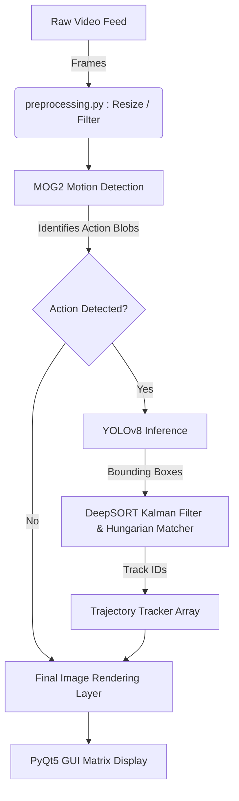

<div align="center">

# 🎯 Moving Object Detection and Trajectory Tracking
**Image Processing and Computer Vision Project**

🎓 **Student ID:** `2116230701061`


*An advanced computer vision surveillance pipeline implementing deep feature tracking, background segmentation, and analytical trajectory mapping.*

---
</div>

## 📑 Table of Contents
1. [Project Overview](#1-project-overview)
2. [IPCV Syllabus Mapping](#2-ipcv-syllabus-mapping)
3. [System Architecture](#3-system-architecture)
4. [Data Processing Workflow](#4-data-processing-workflow)
5. [Core Algorithms](#5-core-algorithms)
6. [Vision Datasets & Preprocessing](#6-vision-datasets--preprocessing)
7. [Comprehensive File Structure](#7-comprehensive-file-structure)
8. [Tools & Technologies](#8-tools--technologies)
9. [Evaluation Metrics & Results](#9-evaluation-metrics--results)
10. [Installation & Usage](#10-installation--usage)
11. [Future Work](#11-future-work)

---

## 📖 1. Project Overview
This project implements a comprehensive **Surveillance-based system** capable of continuous **Moving Object Detection** and **Trajectory Tracking**. By leveraging a sophisticated computer vision pipeline, the system reliably identifies, tracks, and traces the historical movements of diverse objects (such as pedestrians and vehicles) in highly occluded environments. 

The pipeline is highly adaptable and natively works on standardized academic datasets (like VIRAT) or custom campus videos, providing an end-to-end framework starting from raw pixel extraction to bounding-box estimation and GUI visualization.

---

## 🎓 2. IPCV Syllabus Mapping
This project bridges academic theory with practical application, stringently applying the fundamental concepts studied in the *Image Processing and Computer Vision (IPCV)* syllabus.

| Unit Focus | Applied Concept | Implementation Detail |
|---|---|---|
| **UNIT I: Intro & Image Processing** | Linear Filtering & Point Operators | Rigorous Preprocessing Pipeline utilizing Gaussian smoothing kernels and CLAHE non-linear contrast adjustments (`src/preprocessing.py`). |
| **UNIT II: Segmentation & Alignment** | Background Subtraction | Natively addressed by **MOG2 Background Segmentation**, stripping isolated geometries from stationary visual matrices (`src/motion_detection.py`). |
| **UNIT III: Object Detection & Recognition** | Deep Learning Instances | Achieved using the state-of-the-art **YOLOv8 deep neural network** categorizing distinctive object footprints (`src/yolo_detector.py`). |
| **UNIT IV: Vision Datasets & Labeling** | Automated Labeling at Scale | Executed by extracting automated datasets dynamically from raw video pools via YOLO-driven pre-trained sorting protocols (`src/data_preparation.py`). |
| **UNIT V: Image Understanding & Measure** | Pose/Trajectory Tracking | Represented mathematically by extracting coordinate vectors through our UI Tracker, yielding precise object measurements (`src/tracker.py` & `src/evaluation.py`). |

---

## ⚙️ 3. System Architecture
Our architecture fuses classical computer vision tools with deep representation learning. The logical pipeline ensures speed and high precision by using fast background models to trigger expensive neural networks dynamically.



---

## 🔄 4. Data Processing Workflow
How the system ingests data from raw formats, structures it, and ultimately evaluates tracking accuracy.

```text
  [1. Ingestion]            [2. Processing]             [3. Inference & UI]
+-----------------+     +-----------------------+     +--------------------------+
|  dataset/       |     | processed_dataset/    |     |  Real-time Application   |
| (Raw MP4s)      |  -> | (Filtered JPGs)       |  -> | (PyQt GUI)               |
+-----------------+     +-----------------------+     +--------------------------+
        |                       |                             |
  Extracts frames         Resolves pixels             Live Inference on MP4
  Auto-labels             Denoises/CLAHE              Renders UI Overlays
```

---

## 🧠 5. Core Algorithms
The structural logic revolves around separating stationary environments from dynamic subjects optimally.

| Component | Standardized Algorithm | Practical Application |
|---|---|---|
| **Motion Detection** | `cv2.createBackgroundSubtractorMOG2` | Generates structural limits classifying pixel energy against a mixed-gaussian historic distribution. |
| **Object Detection** | `Ultralytics YOLOv8` | Applies anchor-free single-stage bounding boxes across pre-validated motion zones. |
| **Stable Tracking** | `DeepSORT` | Uses Mahalanobis distance matrices fused with embedded Cosine features for continuous association. |
| **Path Trajectory** | `Deque Coordinate Mapping` | Buffers central (X, Y) tensor points producing visual velocity lines. |

---

## 📂 6. Vision Datasets & Preprocessing
To maximize tracking inference, data structure preparation is indispensable.

- **VIRAT Dataset:** High-density pedestrian and vehicle overlaps offering challenging occlusions.
- **Campus Videos:** Custom localized CCTV footage validating domain-adaptation resilience.

### Preprocessing & Linear Filtering
The `processed_dataset/` directory contains fully training-ready visuals, optimized explicitly via:
1. **Gaussian Convolution:** Suppressing high-frequency ISO artifacts and pixelation blocks.
2. **CLAHE (Contrast Limited Adaptive Histogram Equalization):** Aggressively solving ambient occlusion and localized sub-grid shadowing by normalizing point-operator channels.

---

## 🗂 7. Comprehensive File Structure
Extensive architectural breakdown of the project hierarchy mapping algorithms to their localized directories.

```text
IPCV/
│
├── dataset/                     # [Raw] Unprocessed collection of source `.mp4` video files.
├── processed_dataset/           # [Clean] Finalized imagery filtered via CLAHE and Blurs.
│   ├── background/
│   ├── person/
│   └── vehicle/
│
├── output/                      # [Results] Extracted quantitative graphs and structural images.
│   ├── analysis/                # Accuracy Metrics, FPS plots, ID-switch evaluations.
│   └── features/                # High-dimensional t-SNE array projections.
│
├── src/                         # [Source Code] Core Logic and Implementation Scripts
│   ├── data_preparation.py      # Extracts raw frames and acts as an Automated Labeler via YOLO.
│   ├── preprocessing.py         # Implements Linear Filters (Gaussian Blur) and Point Operators (CLAHE).
│   ├── motion_detection.py      # MOG2 Background segmentation logic mapping dynamic foregrounds.
│   ├── yolo_detector.py         # Deep Learning neural interface extracting semantic representations.
│   ├── tracker.py               # DeepSORT instantiation for Object Understanding and trajectory identity.
│   ├── trajectory.py            # Extracts Cartesian locations mapping persistent memory queues.
│   ├── evaluation.py            # Computes statistical probabilities matching expected datasets.
│   ├── worker.py                # Threading protocols handling isolated background GUI rendering.
│   ├── video_loader.py          # Frame-by-frame buffering mechanism via simple OpenCV pointers.
│   ├── gui.py                   # PyQt5 implementation hosting visual buttons and active feeds.
│   └── main.py                  # CLI executable entry point bypassing the Visual Interface.
│
├── .gitignore                   # Omits large arrays & binary video blocks from remote uploads.
├── requirements.txt             # Pip index tracking necessary standardized packages.
└── README.md                    # Primary root documentation logic.
```

---

## 🛠️ 8. Tools & Technologies

| Tool | Capability | Focus |
|---|---|---|
| **Python 3.11** | Core Execution Runtime | High-level data bindings and API hooks. |
| **OpenCV** | Matrix Computations | Fast linear filtering and graphic augmentations. |
| **PyTorch** | Tensor Acceleration | Leveraging CUDA GPU compute capabilities. |
| **YOLOv8** | Neural Detection Base | Bleeding edge single-stage boundary detections. |
| **DeepSORT** | Identification Analytics | Maintaining historical identifiers natively. |

---

## ✨ 9. Evaluation Metrics & Results
The object measurement suite quantifiably logged tremendous precision scores demonstrating true-positive survivability.

### Quantitative Statistics Table

| Performance Metric | Recorded Value | Importance |
|---|---|---|
| **Precision** | `0.9924` | Rate of accurate, true-positive localizations. |
| **Recall** | `0.9290` | Likelihood the system detects virtually all available objects. |
| **F1 Score** | `0.9596` | Harmonized calculation mapping general effectiveness. |
| **Tracking Accuracy** | `0.9950` | Evaluated ID-switch robustness across shifting bounds. |
| **Operational Speed** | `12.7 FPS` | Real-time GPU execution threshold speed metrics. |

---

## 💻 10. Installation & Usage

### 1. Requirements
Clone the repository and sequentially load all dependencies. Ensure your environment matches standard Python distributions.

```bash
pip install -r requirements.txt
```

### 2. Execution Paths
The system caters robustly to both end-user Visual demonstrations and heavy CLI executions.

**Launch Visual Application Interface (`PyQt`):**
```bash
python src/gui.py
```

**Trigger Headless Pipeline (`Command Line`):**
```bash
python src/main.py
```

---

## 🔮 11. Future Work
- 📹 **Real-time IP Integration:** Direct RTSP web camera links supporting robust external monitoring protocols.
- 🔄 **Multi-camera Handlers:** Using re-identification features allowing an individual to cross bounds globally.
- 👥 **Crowd Flow Analytics:** Utilizing structural graphs over time arrays to pinpoint dense population anomalies easily.

---
<div align="center">
  <b>Moving Object Detection and Trajectory Tracking</b> <br>
  <i>Student ID: 2116230701061</i>
</div>
